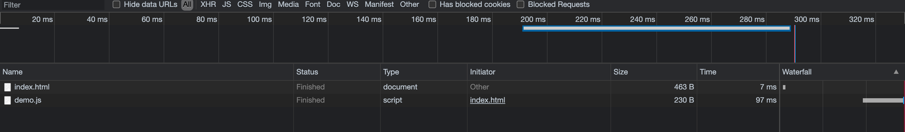
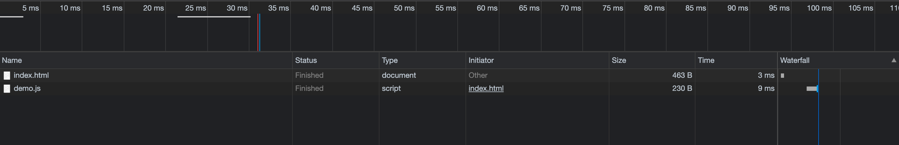

### 首先我们来说一下浏览器是由哪两部分组成？

1. 渲染引擎： 用来解析HTML和CSS，俗称内核，比如chrome浏览器的blink，老版本的webkit
2. JS引擎： 也称为javascript解释器，用来读取网页中的javascript代码，对其处理后运行，比如chrome浏览器的V8
3. 注： 浏览器并不会执行javascript代码，而是通过内置的js引擎(解释器)来执行javascript代码
javascript引擎执行代码时逐行解释每一句源码(转换为机器语言)，然后由计算机去执行，所以javascript语言归为脚本语言，会逐行解释执行

### 补充
1. 大多数浏览器（chrome）让一个单线程供用于执行```JavaScript```和更新用户界面。这个线程通常被称为"浏览器UI线程"，
每个时刻只能执行其中一种操作，这意味着当```JavaScript```代码正在执行时用户界面无法响应输入，
   反之亦然。这样做是因为```JavaScript```代码的作用就是操作```DOM```更新用户页面，
   用同一个线程来做这两件事情可以更高效。
   
2. 浏览器UI线程的工作基于一个简单的队列系统，任务会被保存到队列中直到进程空闲。一旦空闲，队列中的下一个任务就被重新提取出来并运行。这些任务要么是运行javascript代码，要么执行UI更新，包括重绘和重排。
3. 重要的事情说三遍，```javascript是单线程运行 -- 单线程运行 -- 单线程运行```，千万不要被setTimeout()和setInterVal()这种函数迷惑而误以为它是多线程。

### 接下来直入主题
#### 1.原理

一般来说，```<script>```标签每次出现都会霸道的让页面等待脚本的解析和执行。无论当前的
```JavaScript```是内嵌的还是包含了外链文件，页面的下载和渲染都必须停下来等待脚本执行完成。
这在页面的生存周期是必要的，因为脚本的执行过程可能会改变页面的内容。
##### 比如
在页面中使用```document.write()```。方法可向文档写入 HTML 表达式或 JavaScript 代码

当javascript代码是内嵌在html里面时，这点还是比较容易理解，
但当javascript是外链文件时稍微有点负载，因为存在一个加载过程，
而且浏览器加载好这个js文件之后往往还对其缓存。

### 例子
```html
<html>
<head> 
  <script type='text/javascript' src='js/f2.js'></script>
</head>
<body>
</body>
</html> 
```
第一次打开页面

第二次打开页面

从上面两张图可以看出，像chrome之类的高版本浏览器会对js文件进行缓存，作用是不言而喻，减少网络请求。

那么，问题来了。当一个javascript文件被加载时是否会阻塞其他javascript文件或者其他文件的加载呢？

答案是：各种浏览器的低版本的处理是当一个js文件在加载时，会同时阻塞页面其他文件的加载。
（包括其他的js文件）但是ie8、Firfox3.5、Safari 4和Chrome 2都允许并行下载javascript文件，
但是呢，javascript下载过程仍然会阻塞其他资源的下载，比如图片。尽管javascript脚本的下载过程不会相互影响，但页面仍然必须等待所有的javascript代码下载并执行完成才能继续。

#### 2. 优化的方法（技巧）
1. 由于脚本会阻塞页面其他资源的下载，因此我们一般将所有的```<script>```标签放到```<body>```标签的底部，已尽量减少对整个页面下载的影响。
2. 将能合并的js文件合并
3. 无阻塞脚本
   
现在比较常用的方法就是动态加载执行脚本。原理是DOM,可以通过js动态的创建HTML中所有的内容，其根本在于```<script>```
标签与页面中其他元素并无差异，都能通过DOM引用，都能在文档中移动，删除和创建。
文件在该```<script>```元素被添加到页面时开始现在，它不会阻止其他文件下载，只在执行阶段阻塞渲染。
这种方法并不是说它在执行不会阻塞其他```javascript```代码，而是不会阻塞其他资源的下载等其他任务。

```javascript
function loadScript(url){
  var scriptElement = document.createElement('script');
  scriptElement.type = 'text/javascript';
  scriptElement.async = true;
  scriptElement.src = url;
  (document.getElementsByTagName('head')[0] || document.getElementsByTagName('body')[0]).appendChild(scriptElement); 
}
```

